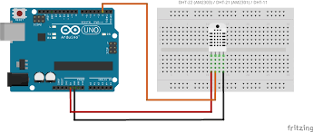

# Monitor temperature and humidity with an ESP32
Tool to monitor temperature and humidity with Adafruit IO dashboard and an ESP32 with DHT22 sensor.

## Summary
 - [How it works](#How-it-works)
 - [Connect the DHT sensor](#Connect-the-DHT-sensor)
 - [Create Adafruit IO dashboard](#Create-Adafruit-IO-Dashboard)
 - [Setup](#Setup)
 - [Built with](#Built-with)


## How it works

The tool measures temperature and humidity every 2 hours by default (the time between each measurement can be modified in the config.h file).
The data is stored on an Adafruit IO feed to be visualized in a dashboard. 

Between each measurement, the ESP goes into deep sleep mode.  

## Connect the DHT sensor



## Create Adafruit IO Dashboard

* See this link for create a feed: 
https://learn.adafruit.com/adafruit-io-basics-feeds/creating-a-feed

* See this link for create a feed: (create a feed for temperature and another for humidity)
https://learn.adafruit.com/adafruit-io-basics-dashboards/creating-a-dashboard

* Get your Adafruit Key:
Click on the tab "My Key"


* Get your Adafruit feed key:
Go to the feeds page to see the key of your feed


## Setup 


* First copy the template:  
`cp config_template.h config.h`

* Configure the following variables with your credentials:  
```
/* WIFI Setting */
#define WIFI_SSID "YOUR_WIFI_SSID"     /* Replace with your wifi ssid. */
#define WIFI_PWD "YOUR_WIFI_PASSWORD"  /* Replace with your wifi password */

/* Adafruit IO settings */
#define IO_USERNAME "YOUR ADAFRUIT USERNAME" /* Replace with your adafruit username. */
#define IO_KEY "YOUR ADAFRUIT KEY"           /* Replace with your adafruit key.      */
#define IO_FEED_HUMIDITY "HUMIDITY FEED NAME"    /* Replace with your adafruit humidity feed name. */
#define IO_FEED_TEMP "TEMPERATURE FEED NAME"     /* Replace with your adafruit humidity feed name. */
```

## Built with

* ESP32 NodeMCU Module WLAN WiFi Development Board with CP2102 
* Sensor DHT22
